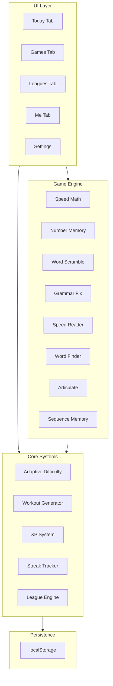

# VibeCode — Brain Training Web App

A brain training web application designed to improve cognitive skills through personalized daily workouts, 
mini-games, performance tracking, streaks, and competitive leagues.

## Background

Based on the [idea.md](file:///c:/VibeCode/idea.md) specification, VibeCode is an Elevate-inspired brain training
platform. The app features 5 learning categories, daily personalized workouts, adaptive difficulty,
streak tracking, XP-based leagues, and detailed performance analytics — all wrapped in a premium,
modern UI.

## User Review Required

> [!IMPORTANT]
> **Tech Stack Decision**: This plan uses **Vite + React** (single-page app) with **localStorage** for 
> data persistence. There is no backend — all data lives in the browser. If you'd prefer a backend 
> (Node/Express + database) for real multi-user features like actual multiplayer leagues, please let me know.

> [!IMPORTANT]
> **Game Count**: The idea mentions "40+ games." For the initial build, I'll implement **8 fully playable 
> games** (at least 1 per category) with polished mechanics and adaptive difficulty. More games can be 
> added iteratively. If you want more games in the first release, let me know.

> [!WARNING]
> **No Authentication**: Since this is a client-side-only app, there's no login/signup system. 
> All progress is stored in localStorage. Clearing browser data will reset progress.

---

## Proposed Changes

### Phase 1: Project Setup & Design System

#### [NEW] Vite + React Project Scaffold
- Initialize with `npx -y create-vite@latest ./ -- --template react`
- Install dependencies: `react-router-dom`, `lucide-react` (icons), `framer-motion` (animations)
- Configure folder structure:

```
src/
├── components/       # Shared UI components
│   ├── Layout.jsx    # App shell with tab navigation
│   ├── TabBar.jsx    # Bottom tab bar
│   ├── GameCard.jsx  # Game tile component
│   ├── StreakBadge.jsx
│   ├── XPBar.jsx
│   └── ...
├── pages/            # Tab pages
│   ├── Today.jsx     # Daily workouts, puzzles, streak
│   ├── Leagues.jsx   # Weekly competitions
│   ├── Games.jsx     # All games by category
│   ├── Me.jsx        # Profile, stats, achievements
│   └── Settings.jsx  # Preferences
├── games/            # Individual game modules
│   ├── math/
│   ├── reading/
│   ├── writing/
│   ├── speaking/
│   └── memory/
├── hooks/            # Custom React hooks
│   ├── useGameState.js
│   ├── useStreak.js
│   └── useXP.js
├── utils/            # Helpers
│   ├── storage.js    # localStorage wrapper
│   ├── difficulty.js # Adaptive difficulty engine
│   └── workout.js    # Daily workout generator
├── data/             # Static game data, word lists
├── App.jsx
├── App.css
├── index.css         # Design system & global styles
└── main.jsx
```

#### [NEW] `src/index.css` — Design System
- Dark-theme-first design with rich gradients (deep indigo → violet → electric blue)
- CSS custom properties for colors, spacing, typography, border-radius, shadows
- Google Font: **Inter** (clean, modern, excellent readability)
- Glassmorphism cards with `backdrop-filter: blur()`
- Smooth transition and animation utility classes
- Responsive breakpoints

---

### Phase 2: App Shell & Navigation

#### [NEW] `src/components/Layout.jsx`
- Full-screen app container with bottom tab bar
- Animated page transitions via `framer-motion`

#### [NEW] `src/components/TabBar.jsx`
- 4 main tabs: **Today**, **Leagues**, **Games**, **Me**
- Active tab indicator with smooth sliding animation
- Icons from `lucide-react`: Home, Trophy, Gamepad2, User

#### [NEW] `src/App.jsx`
- React Router setup with tab routes
- Global state provider (React Context) for user data, XP, streak

---

### Phase 3: Today Tab (Home)

#### [NEW] `src/pages/Today.jsx`
- **Header**: Greeting + streak badge (top right corner)
- **Featured Workout**: Card showing today's personalized 3-game workout
- **Daily Puzzle**: A single quick puzzle (e.g., word scramble or quick math)
- **Word of the Day**: Randomly selected vocabulary word with definition and usage
- **Recent & Favorite Games**: Horizontal scrollable row of game cards
- **Quick Stats**: Today's XP earned, games played

#### [NEW] `src/utils/workout.js`
- Generates daily workout based on:
  - User's weakest categories (from performance history)
  - Categories they haven't practiced recently
  - Randomized selection within chosen categories
- Deterministic daily seed so workout is consistent per day

---

### Phase 4: Games Tab & Mini-Games

#### [NEW] `src/pages/Games.jsx`
- Category filter tabs: Writing, Speaking, Reading, Math, Memory
- "Show Game Statistics" toggle
- Grid of game cards showing: name, icon, category, high score, difficulty level

#### 8 Playable Games (at least 1 per category):

| # | Game | Category | Mechanic |
|---|------|----------|----------|
| 1 | **Speed Math** | Math | Solve arithmetic problems against a timer |
| 2 | **Number Memory** | Math | Remember and recall increasingly long number sequences |
| 3 | **Word Scramble** | Writing | Unscramble letters to form words |
| 4 | **Grammar Fix** | Writing | Identify and correct grammatical errors in sentences |
| 5 | **Speed Reader** | Reading | Read passages at increasing speeds, answer comprehension questions |
| 6 | **Word Finder** | Reading | Find target words in a grid of text |
| 7 | **Articulate** | Speaking | Given a topic, form a concise explanation (timed, self-rated) |
| 8 | **Sequence Memory** | Memory | Remember and reproduce sequences of highlighted tiles |

Each game will have:
- **Adaptive difficulty**: Difficulty scales up on correct streaks, scales down on failures
- **Scoring**: Points based on accuracy × speed
- **Results screen**: Score, accuracy %, time, XP earned, new high score indicator
- **Smooth animations**: Card flips, score counters, progress bars

#### [NEW] `src/utils/difficulty.js`
- Tracks per-game difficulty level (1–10)
- Increases difficulty after 3 consecutive correct answers
- Decreases after 2 consecutive wrong answers
- Adjusts parameters per game (e.g., timer length, number of items, problem complexity)

---

### Phase 5: Leagues Tab

#### [NEW] `src/pages/Leagues.jsx`
- **Current League**: Bronze → Silver → Gold → Platinum → Diamond
- **Leaderboard**: Simulated weekly competition with AI opponents
  - 10 simulated players with randomized names and XP
  - User ranked among them
- **Weekly XP Progress Bar**
- **Promotion/Demotion zones** highlighted
- League resets weekly (every Monday)

---

### Phase 6: Me Tab & Performance

#### [NEW] `src/pages/Me.jsx`
- **Profile Header**: Avatar (generated initials), username, join date
- **Stats Dashboard**:
  - Current streak (with flame animation)
  - Current league badge
  - Total XP (with animated counter)
  - EPQ (Elevate Performance Quotient) — aggregate score across all categories
- **Category Rankings**: Radar/spider chart showing relative strengths
- **Achievement Badges**: Grid of unlockable achievements
  - "First Game", "7-Day Streak", "100 XP", "Category Master", etc.
- **Workout Calendar**: Monthly calendar view with colored dots for active days

#### [NEW] `src/pages/Settings.jsx`
- Workout length (3, 5, or 7 games)
- Training goals (focus areas)
- Sound effects toggle
- Dark/light mode toggle
- Reset progress button
- Notification preferences (visual only since no backend push)

---

### Phase 7: Data Persistence & Hooks

#### [NEW] `src/utils/storage.js`
- `saveUserData(data)` / `loadUserData()` — JSON serialization to localStorage
- Auto-save on state changes
- Data schema versioning for future migrations

#### [NEW] `src/hooks/useStreak.js`
- Calculates current streak from workout calendar
- Determines if today's workout is complete
- Streak freeze logic (optional)

#### [NEW] `src/hooks/useXP.js`
- XP earned per game based on score and difficulty
- Weekly XP tracking for leagues
- Total XP accumulation

---

## Architecture Overview



---

## Open Questions

> [!IMPORTANT]
> 1. **Username**: Should the app ask for a username on first launch, or use a default like "Player"?
> 2. **Sound Effects**: Should I include sound effects for correct/wrong answers and game events? (Adds polish but increases bundle size)
> 3. **More games on initial release?**: I can add more games beyond 8 if you want a richer initial experience. What's your priority — more games or more polish on fewer games?

---

## Verification Plan

### Automated Tests
- Run `npm run build` to verify the app compiles without errors
- Manually test each game for playability and scoring

### Browser Testing
- Use the browser tool to navigate through all tabs and verify:
  - Tab navigation works correctly
  - Each game loads and is playable
  - Streak tracking updates properly
  - XP accumulates correctly
  - League leaderboard displays
  - Performance stats render on the Me tab
  - Settings persist across page reloads

### Visual Verification
- Capture screenshots of each major screen
- Verify dark theme, glassmorphism, animations, and responsive layout
